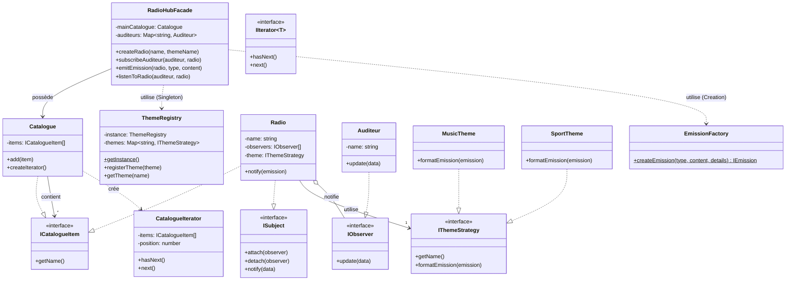

# RadioHub - Documentation Technique

**Auteurs :**  
- Théo Garcès
- [Ajouter autres membres]

---

## 1. Introduction
Ce document présente l'architecture logicielle du projet RadioHub, un agrégateur de web-radios conçu selon les principes SOLID et utilisant des Design Patterns classiques. L'objectif est de fournir une solution modulaire, extensible et maintenable.

L'application permet :
- De gérer un catalogue de radios.
- De s'abonner à des flux (Stations).
- De diffuser des émissions avec des notifications en temps réel (simulées).
- D'ajouter de nouveaux types de contenus sans modifier le cœur du système.

---

## 2. Diagramme de Classes (UML Détaillé)
Voici la structure des classes principales et leurs interactions.

---

## 3. Analyse Architecturale & Design Patterns

### 3.1. Façade (CU_9)
- **Problème :** Le système interne est complexe (gestionnaires de thèmes, itérateurs, factories). Exposer cette complexité au contrôleur Web rendrait le code difficile à maintenir.
- **Solution :** La classe `RadioHubFacade` centralise toutes les opérations. Le serveur Express n'appelle que cette classe.
- **Avantage :** Découplage total entre la couche présentation (API/Web) et la couche métier.

### 3.2. Observer (CU_1 & CU_2)
- **Problème :** Comment informer les auditeurs qu'une émission commence sans que la Radio ne connaisse les détails spécifiques de l'auditeur ?
- **Solution :** Pattern Pub/Sub. La `Radio` (Subject) maintient une liste d'abonnement. L'`Auditeur` (Observer) implémente une méthode `update`.
- **Avantage :** On peut ajouter des milliers d'auditeurs sans modifier la classe Radio.

### 3.3. Strategy & Registry (CU_5)
- **Problème :** Comment gérer différents formats d'affichage (Musique vs Sport) et permettre l'ajout de futurs thèmes (Météo, Bourse) sans violer le principe Open/Closed ?
- **Solution :** Une interface `IThemeStrategy`. Chaque thème est une classe (`MusicTheme`, `SportTheme`). Un `ThemeRegistry` (Singleton) les recense.
- **Avantage :** Pour ajouter un thème "Cinéma", il suffit de créer la classe et de l'enregistrer. Aucune modification de `Radio.ts` n'est requise.

### 3.4. Iterator (CU_3)
- **Problème :** Parcourir le catalogue sans exposer sa structure de stockage interne (Array, Set, Map).
- **Solution :** L'interface `IIterator` standardise le parcours (`hasNext`, `next`).
- **Avantage :** Si demain le catalogue devient un arbre complexe ou une base de données distante, le code client (qui liste les radios) restera identique.

### 3.5. Factory (CU_6)
- **Problème :** La création d'objets JSON pour les émissions est répétitive et dépend du type.
- **Solution :** `EmissionFactory.createEmission(type, ...)` gère l'instanciation et le formatage des données.
- **Avantage :** Centralisation de la logique de création. Si le format JSON change, on ne modifie qu'un seul fichier.

---

## 4. API & Commandes

L'application expose une API REST simplifiée sur le port 3000.

| Méthode | Route | Description | Exemple Body |
|---------|-------|-------------|--------------|
| GET | `/radios` | Liste le catalogue complet | - |
| POST | `/subscribe` | Abonne un auditeur | `{"auditeur": "Theo", "radio": "Skyrock"}` |
| POST | `/unsubscribe` | Désabonne un auditeur | `{"auditeur": "Theo", "radio": "Skyrock"}` |
| POST | `/message` | Envoi un message à l'animateur (CU_7) | `{"auditeur": "Theo", "radio": "Skyrock", "message": "Salut"}` |
| POST | `/listen` | Simule l'écoute du flux audio (CU_8) | `{"auditeur": "Theo", "radio": "Skyrock"}` |
| POST | `/emit` | Diffuse une émission | `{"radio": "Skyrock", "type": "Musique", "content": "Hit", "details": {...}}` |
| POST | `/radios` | Crée une radio (Admin) | `{"name": "Fun", "theme": "Musique"}` |

---

## 5. Réflexion Critique & Limitations

### Ce qui fonctionne bien
- L'architecture est très découplée. Ajouter une fonctionnalité métier se fait souvent sans toucher au serveur Web.
- Le principe Open/Closed est respecté pour les thèmes.

### Limitations actuelles
- **Pas de persistance :** Les données sont en mémoire (RAM). Au redémarrage serveur, tout est perdu.
- **Synchronisme :** Les notifications sont envoyées de manière synchrone (bloquante). Si 100 000 auditeurs sont abonnés, le serveur figera pendant la notification. Il faudrait utiliser des files d'attente (RabbitMQ/Redis) pour passer à l'échelle.
- **Gestion des erreurs :** La gestion des erreurs est basique.

### Améliorations possibles
- Implémenter le pattern **Composite** plus profondément pour gérer des sous-catégories de radios (Dossier Rock -> Radios Rock).
- Ajouter une vraie persistance (SQLite ou MongoDB).
